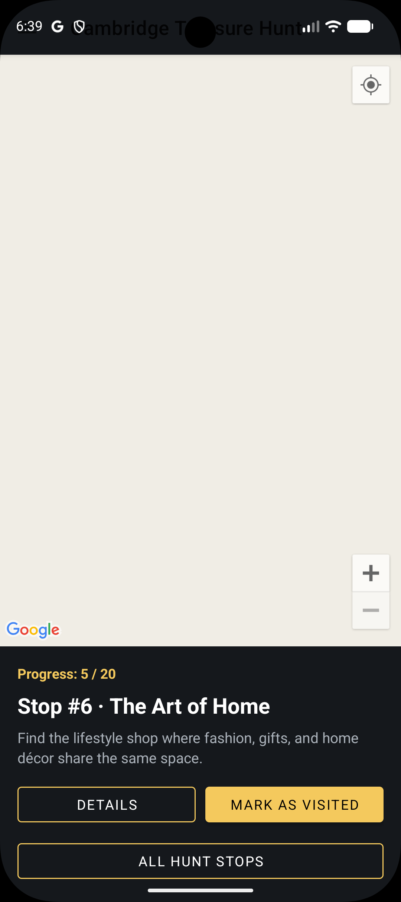
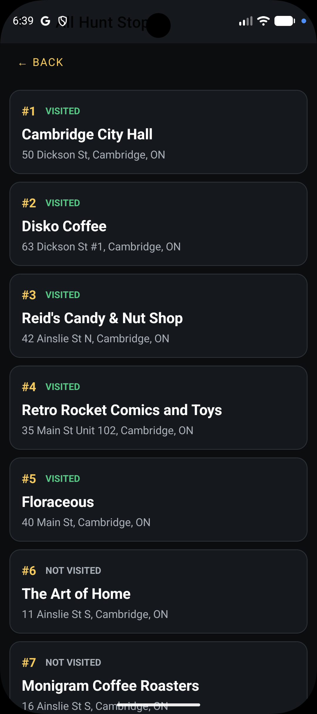
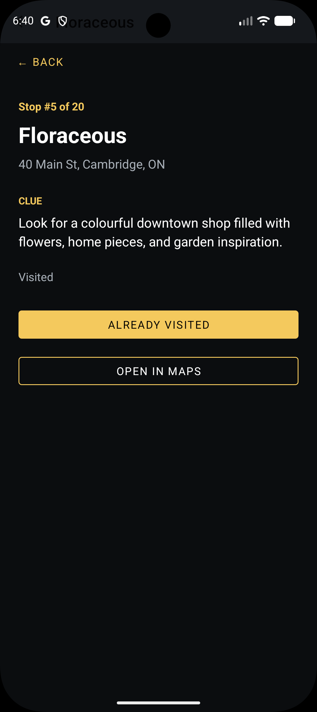
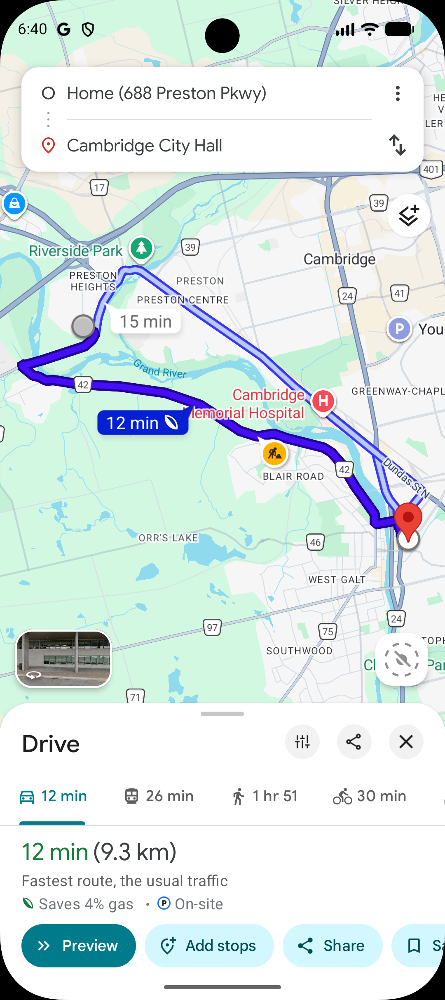

# AndroidApp3 – Cambridge Treasure Hunt

AndroidApp3 is a location-based treasure hunt game created for a weekly Android development assignment.

The app celebrates Cambridge, Ontario by guiding participants through a sequence of 20 local stops. The hunt begins at Cambridge City Hall. After a participant marks the current stop as visited, the next location becomes available.

## Core Features

- Google Maps integration
- Runtime location permission handling
- Current-location support
- 20 sequential treasure-hunt stops
- Cambridge City Hall as the starting point
- Local Cambridge businesses and landmarks
- Room database persistence
- Progress tracking
- RecyclerView list of all hunt locations
- Detail screen for each location
- Navigation drawer
- Reset-progress option
- Clear comments throughout the Kotlin code

## PlaceBook Concepts Applied

This project adapts concepts from the PlaceBook tutorial:

- Map-based user interface
- Google Maps markers
- User location and permissions
- Local Room database storage
- Multiple activities and intents
- RecyclerView and adapters
- Navigation drawer
- Location details and notes/clues

## Screenshots

<p align="center">
  
  
  
  
</p>

## Setup

1. Open the project in Android Studio.
2. Allow Gradle to sync.
3. Create or use a Google Maps API key.
4. Open `local.properties` in the project root and add:

```properties
MAPS_API_KEY=YOUR_GOOGLE_MAPS_API_KEY
```

5. Run the app on an emulator or Android device with Google Play services.

> Note: `local.properties` is intentionally ignored by Git so the API key is not uploaded to GitHub.

## Treasure Hunt Flow

1. Start at Cambridge City Hall.
2. Read the clue for the current location.
3. Visit the location.
4. Tap **MARK AS VISITED**.
5. The next location becomes available.
6. Repeat until all 20 locations have been visited.
7. The app displays a completion message confirming vacation-draw eligibility.

## Repository

Expected GitHub repository name:

`AndroidApp3`

Example:

`https://github.com/jeanvq/AndroidApp3.git`
