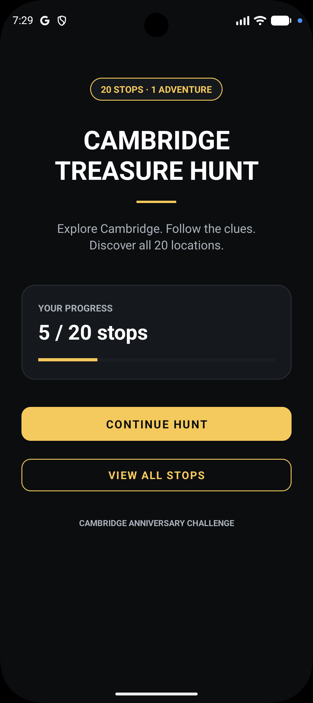
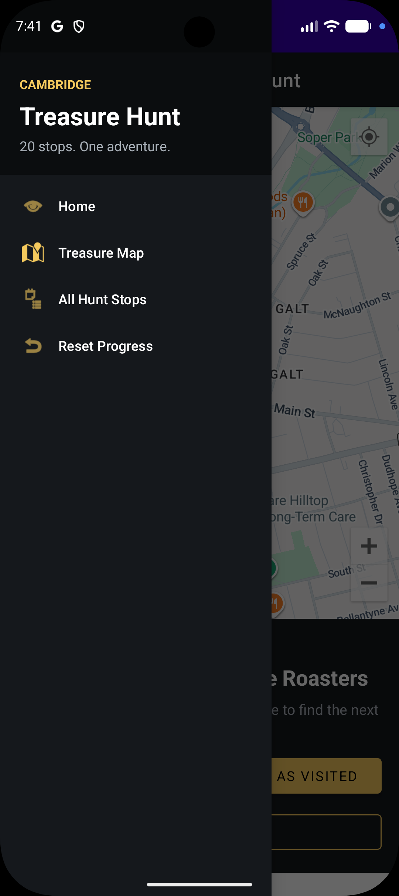
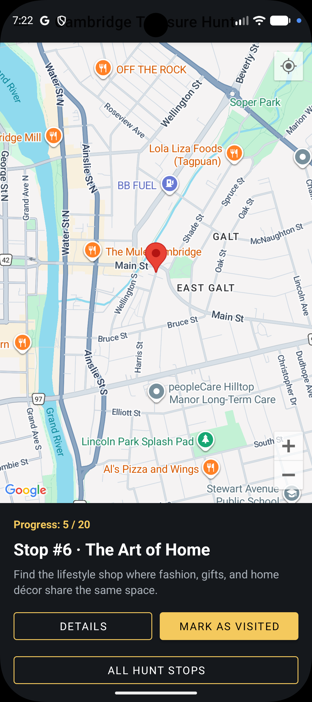
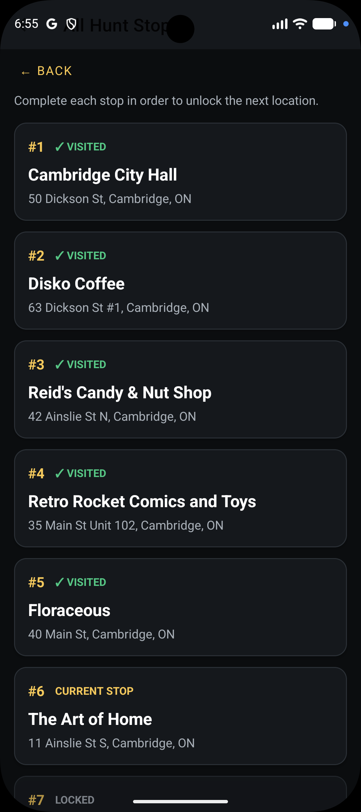

# AndroidApp3 – Cambridge Treasure Hunt

AndroidApp3 is a location-based treasure hunt game created for an Android development assignment.

The app celebrates Cambridge, Ontario by guiding participants through a sequence of 20 local stops. The hunt begins at Cambridge City Hall. After a participant marks the current stop as visited, the next location becomes available.

## Assignment 6 Polish

The final version adds a dedicated Home screen, clearer progress feedback, improved navigation, polished stop cards, and distinct **Visited**, **Current Stop**, and **Locked** states while keeping the original treasure-hunt flow simple.

## Core Features

- Home screen with saved hunt progress
- Google Maps integration
- Runtime location permission handling
- Current-location support
- 20 sequential treasure-hunt stops
- Cambridge City Hall as the starting point
- Local Cambridge businesses and landmarks
- Room database persistence
- Progress tracking and progress bar
- Visited, current, and locked stop states
- RecyclerView list of all hunt locations
- Detail screen for each location
- Open location in Maps
- Navigation drawer with Home, Treasure Map, and All Hunt Stops
- Reset-progress option
- Completion message after all 20 stops
- Clear comments throughout the Kotlin code

## PlaceBook Concepts Applied

This project adapts concepts from the PlaceBook tutorial:

- Map-based user interface
- Google Maps markers and camera control
- User location and runtime permissions
- Local Room database storage
- Multiple activities and intents
- RecyclerView and adapters
- Navigation drawer
- Location details and clues

## Screenshots

### Home

<p align="center">
  
</p>

### Navigation Drawer

<p align="center">
  
</p>

### Treasure Map

<p align="center">
  
</p>

### Place Details

<p align="center">
  
</p>

## Setup

1. Open the project in Android Studio.
2. Allow Gradle to sync.
3. Enable **Maps SDK for Android** in Google Maps Platform and create an API key.
4. Open `local.properties` in the project root and add:

```properties
MAPS_API_KEY=YOUR_GOOGLE_MAPS_API_KEY
```

5. Run the app on an emulator or Android device with Google Play services.

> `local.properties` is intentionally ignored by Git so the API key is not uploaded to GitHub.

## Treasure Hunt Flow

1. Open the Home screen and view the saved progress.
2. Tap **START HUNT** or **CONTINUE HUNT** to open the treasure map.
3. Read the clue for the current location.
4. Visit the location and tap **MARK AS VISITED**.
5. The next location becomes the new current stop while future stops remain locked.
6. Use **All Hunt Stops** to review visited, current, and locked locations.
7. Repeat until all 20 locations have been visited.
8. The app displays a completion message confirming vacation-draw eligibility.

## Repository

https://github.com/jeanvq/AndroidApp3
